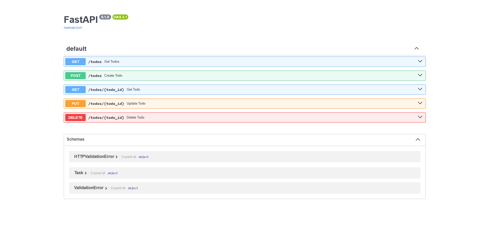

# FastAPI Todo API

A simple RESTful Todo API built with FastAPI that supports full CRUD (Create, Read, Update, Delete) operations.

## Features

* Create a new Todo
* Read all Todos
* Read a Todo by ID
* Update an existing Todo
* Delete a Todo

## Requirements

* Python 3.11+
* FastAPI
* Uvicorn

## Installation

Clone the repository:

```bash
git clone https://github.com/ansary-11/fastapi-todo-api.git
cd fastapi-todo-api
```

Install the required packages:

```bash
pip install -r requirements.txt
```

## Run the Project

Start the FastAPI development server:

```bash
uvicorn main:app --reload
```

The API will be available at:

```
http://127.0.0.1:8000
```

## API Documentation (Swagger)

Open your browser and visit:

```
http://127.0.0.1:8000/docs
```

## Endpoints

| Method | Endpoint      | Description             |
| ------ | ------------- | ----------------------- |
| GET    | `/todos`      | Get all todos           |
| GET    | `/todos/{id}` | Get a single todo       |
| POST   | `/todos`      | Create a new todo       |
| PUT    | `/todos/{id}` | Update an existing todo |
| DELETE | `/todos/{id}` | Delete a todo           |

## Example curl Output

```text
C:\Users\abdelrahman>curl -i http://127.0.0.1:8000/todos

HTTP/1.1 200 OK
date: Wed, 22 Jul 2026
server: uvicorn
content-type: application/json

[
  {
    "title": "First todo",
    "description": "This is the first todo",
    "done": false
  }
]
```

## Swagger Screenshot


images/swagger.png


Then it will appear below:




Abdelrahman Ansary
